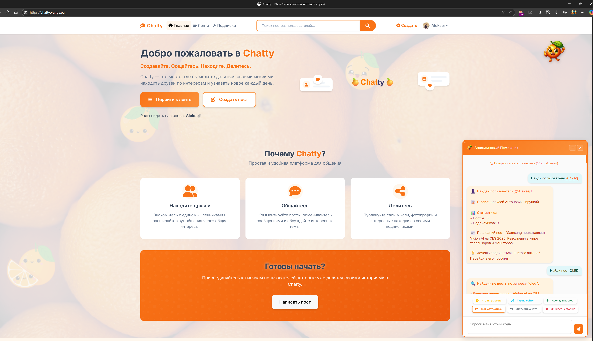
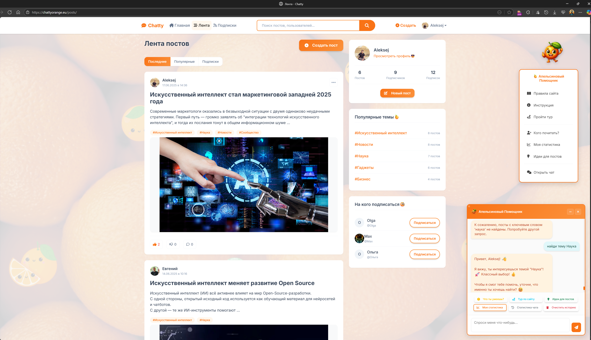
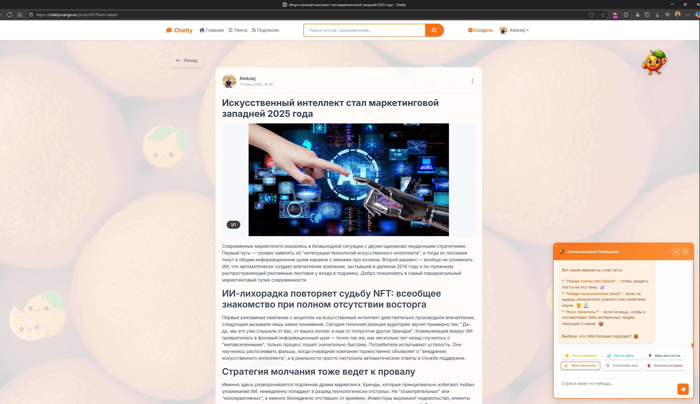
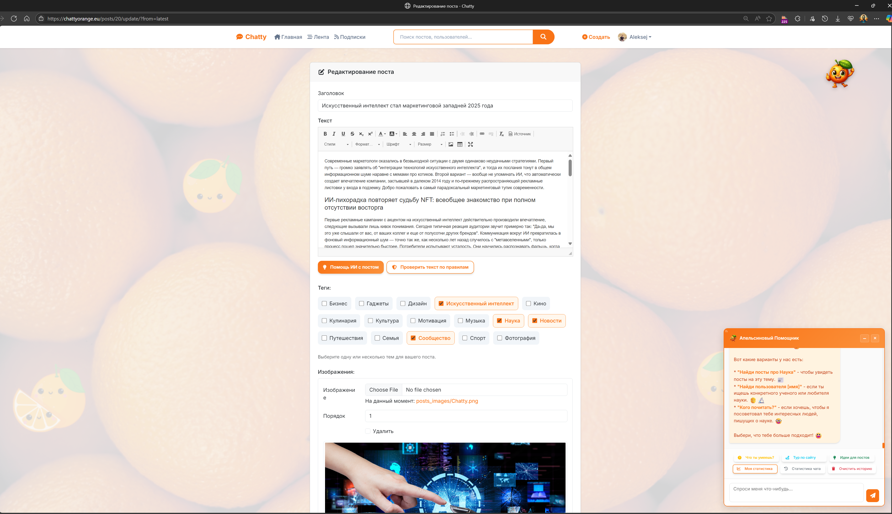
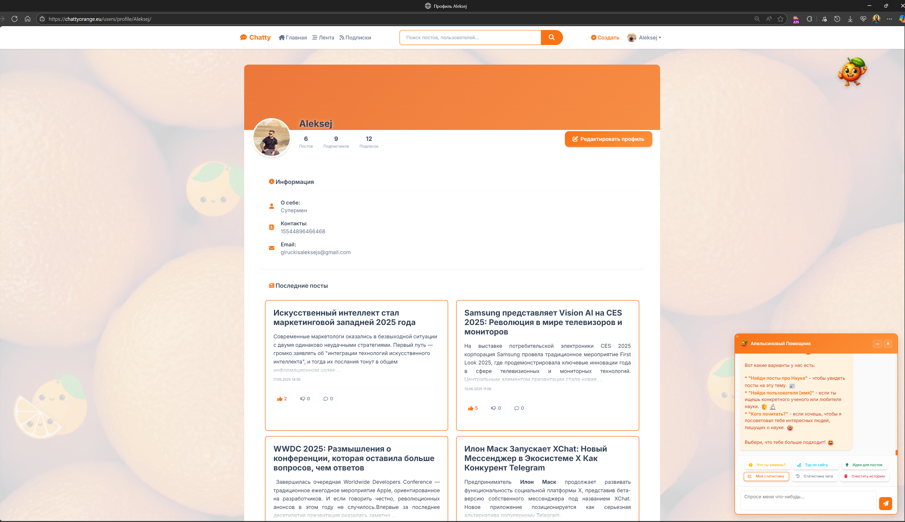

# 📘 Chatty Orange - Социальная сеть на Django

[](https://www.djangoproject.com/)
[](https://www.python.org/)
[](https://www.postgresql.org/)
[](https://www.docker.com/)
[](https://ai.google.dev/)

Chatty Orange — полноценная социальная сеть, разработанная на Django с уникальным **ИИ-помощником**. Платформа позволяет пользователям создавать контент, общаться, подписываться на авторов и получать персонализированные рекомендации от искусственного интеллекта.

**🌐:** [https://chattyorange.eu](https://chattyorange.eu)

---

## 📸 Демонстрация

### 🏠 Главная страница
Современный и привлекательный дизайн с призывом к действию и интуитивной навигацией.



*Особенности: адаптивный дизайн, брендинг с апельсиновой тематикой, четкие CTA-кнопки и видимый ИИ-помощник справа*

### 📰 Лента постов
Персонализированная лента с фильтрацией, популярными темами и рекомендациями для подписки.



*Технические особенности: пагинация Django, AJAX-лайки, система тегов, оптимизированные запросы с `select_related`*

### 📝 Детальная страница поста
Полное отображение контента с комментариями, лайками и интерактивными элементами.



*Функционал: система комментариев, счетчики лайков, AJAX-взаимодействие, SEO-оптимизированные URL*

### ✏️ Редактор постов
Мощный редактор с поддержкой Rich Text, тегов и множественной загрузки изображений.



*Django формы: ModelForm с кастомными виджетами, валидация на клиенте и сервере, обработка файлов*

### 👤 Профиль пользователя
Персональные страницы с статистикой, постами и возможностью подписки.



*Архитектура: Class-Based Views, система подписок Many-to-Many, статистика через агрегацию Django ORM*

---


## 🍊 Апельсиновый Помощник - ИИ-ассистент

**Уникальная особенность проекта** - встроенный ИИ-помощник, который делает использование сайта более комфортным и интуитивным:

- **🤖 Умный поиск:** Найдет пользователей и посты по вашему запросу
- **💡 Персональные рекомендации:** Подскажет интересных авторов для подписки
- **🎯 Помощь новичкам:** Объяснит функции сайта и поможет с навигацией
- **💬 Интерактивный чат:** Красивый виджет в правом нижнем углу, который не мешает работе с сайтом
- **📱 Адаптивный дизайн:** Отлично работает на всех устройствах
- **💾 Память разговоров:** Сохраняет историю чата для каждого пользователя

**Технологии:** Google Gemini API, AJAX, localStorage, современный UX/UI

## 🎯 Функциональность

- **Аутентификация:**
  - Регистрация по email с подтверждением
  - Авторизация по email и паролю
  - Сброс пароля

- **Профиль пользователя:**
  - Просмотр и редактирование профиля
  - Загрузка аватара
  - Управление личной информацией (имя, описание, контакты)

- **Контент:**
  - Создание, редактирование и удаление постов
  - Прикрепление изображений к постам
  - Комментирование постов
  - Лайки постов
  - Теги для категоризации контента
  - Просмотр ленты всех постов и ленты подписок

- **Подписки:**
  - Подписка/отписка на других пользователей
  - Персонализированная лента постов от авторов, на которых вы подписаны
  - Просмотр списков подписчиков и подписок

- **ИИ-Помощник:**
  - Интеллектуальный поиск контента и пользователей
  - Персонализированные рекомендации
  - Помощь в освоении функций сайта
  - Интерактивный тур для новых пользователей

- **Администрирование:**
  - Панель администратора для модерации контента
  - Управление пользователями, постами и комментариями
  - Аналитика активности пользователей

## 🛠️ Технологический стек

- **Язык программирования:** Python 3.11
- **Веб-фреймворк:** Django 5.1.5
- **Шаблоны:** Django Templates + Bootstrap 5 + CSS
- **Frontend:** JavaScript (AJAX, localStorage) + современный UX/UI
- **ИИ-интеграция:** Google Gemini API для умного помощника
- **ORM:** Django ORM
- **База данных:** PostgreSQL 15
- **Хранение файлов:** локально/MinIO
- **Контейнеризация:** Docker + Docker Compose
- **Веб-сервер:** Nginx + Gunicorn
- **SSL:** Let's Encrypt
- **Тестирование:** Pytest / Unittest
- **Контроль версий:** Git + GitHub
- **CI/CD:** Docker Hub

## 📂 Структура проекта

Проект имеет модульную структуру и следует принципам Django-приложений:

```
chatty/
├── Chatty_orange/          # Основное приложение (настройки)
├── users/                  # Управление пользователями
├── posts/                  # Посты, комментарии, лайки
├── subscriptions/          # Подписки и лента
├── orange_assistant/       # ИИ-помощник (новое приложение)
├── templates/              # Глобальные шаблоны
├── static/                 # Статические файлы
│   ├── css/               # Стили (включая orange-assistant.css)
│   └── js/                # JavaScript (включая orange-assistant.js)
└── media/                  # Загружаемые файлы
```

Подробная информация о структуре проекта доступна в файле [Project_structure.md](Project_structure.md).

## 🚀 Установка и запуск

### Продакшен-развертывание

1. Клонируйте репозиторий:
   ```bash
   git clone https://github.com/AleksejsGir/Chatty_orange.git
   cd Chatty_orange
   ```

2. Создайте файл `.env.prod` в корневой директории проекта:
   ```
   # Django Settings
   DJANGO_SETTINGS_MODULE=Chatty_orange.settings.production
   DJANGO_DEBUG=False
   SECRET_KEY=your_secure_secret_key
   
   # Domain and Host Settings
   DJANGO_ALLOWED_HOSTS=yourdomain.com www.yourdomain.com
   CSRF_TRUSTED_ORIGINS=https://yourdomain.com https://www.yourdomain.com
   
   # Database Settings
   DB_ENGINE=django.db.backends.postgresql
   DB_NAME=chatty_db
   DB_USER=db_user
   DB_PASSWORD=secure_password
   DB_HOST=db_prod
   DB_PORT=5432
   
   # AI Assistant Settings
   GOOGLE_API_KEY=your_google_gemini_api_key
   
   # Email Settings
   EMAIL_BACKEND=django.core.mail.backends.smtp.EmailBackend
   EMAIL_HOST=smtp.gmail.com
   EMAIL_PORT=587
   EMAIL_USE_TLS=True
   EMAIL_HOST_USER=your_email@gmail.com
   EMAIL_HOST_PASSWORD=your_app_password
   DEFAULT_FROM_EMAIL=Your Site <your_email@gmail.com>
   
   # Gunicorn Settings
   GUNICORN_CMD_ARGS=--workers 3 --bind 0.0.0.0:8000 --timeout 120
   ```

3. Запустите проект с использованием Docker Compose:
   ```bash
   docker compose -f docker-compose.prod.yml up -d
   ```

4. Выполните миграции и создайте суперпользователя:
   ```bash
   docker compose -f docker-compose.prod.yml exec web_prod python manage.py migrate
   docker compose -f docker-compose.prod.yml exec web_prod python manage.py createsuperuser
   ```

5. Приложение будет доступно по настроенному домену с SSL-сертификатом.

### Локальная разработка

1. Клонируйте репозиторий:
   ```bash
   git clone https://github.com/AleksejsGir/Chatty_orange.git
   cd Chatty_orange
   ```

2. Создайте файл `.env` в корневой директории проекта:
   ```
   # Django Settings
   DEBUG=True
   SECRET_KEY=dev_secret_key
   
   # Database Settings
   DB_ENGINE=django.db.backends.postgresql
   DB_NAME=chatty_db_dev
   DB_USER=chatty_user
   DB_PASSWORD=password
   DB_HOST=db
   DB_PORT=5432
   
   # AI Assistant Settings (опционально для разработки)
   GOOGLE_API_KEY=your_google_gemini_api_key
   ```

3. Запустите проект с использованием Docker Compose для разработки:
   ```bash
   docker-compose up -d
   ```

4. Выполните миграции и создайте суперпользователя:
   ```bash
   docker-compose exec web python manage.py migrate
   docker-compose exec web python manage.py createsuperuser
   ```

5. Приложение будет доступно по адресу: http://localhost:8000

## 🤖 Настройка ИИ-помощника

Для работы Апельсинового Помощника требуется API ключ Google Gemini:

1. Перейдите на [Google AI Studio](https://aistudio.google.com/)
2. Создайте бесплатный API ключ
3. Добавьте его в файл `.env` или `.env.prod`:
   ```
   GOOGLE_API_KEY=your_api_key_here
   ```

**Без API ключа ИИ-помощник не будет работать, но остальной функционал сайта останется доступным.**

## 🧪 Тестирование

Проект использует [Pytest](https://pytest.org/) для написания и запуска тестов. Тесты помогают обеспечить стабильность и надежность кода.

Для запуска всех тестов локально (предполагается, что вы находитесь в активированном окружении с установленными зависимостями, как описано в [TESTING.md](TESTING.md)):

```bash
docker-compose exec web pytest
```
Более подробную информацию о настройке тестового окружения, различных вариантах запуска тестов (включая запуск отдельных тестов, генерацию отчетов о покрытии), используемых инструментах и структуре тестов вы можете найти в файле [TESTING.md](TESTING.md).

Тесты также автоматически запускаются в CI/CD при каждом push и pull request в основные ветки, используя GitHub Actions. Отчеты о покрытии кода загружаются в Codecov.

## 📊 Архитектура проекта

Проект реализован в монолитной архитектуре и состоит из следующих приложений:

- **Chatty_orange** - базовые настройки, разделенные на модули для разработки и продакшена
- **users** - управление пользователями, профили, аутентификация
- **posts** - модели и представления для постов, комментариев и лайков
- **subscriptions** - логика подписок и формирования персонализированной ленты
- **orange_assistant** - ИИ-помощник с интеграцией Google Gemini API

## 🎮 Демо команды для ИИ-помощника

Попробуйте следующие команды в чате с Апельсиновым Помощником:

- `"Найди пользователя admin"` - поиск конкретного пользователя
- `"Найди посты про Django"` - поиск постов по ключевому слову
- `"Кого почитать?"` - персональные рекомендации авторов
- `"Что ты умеешь?"` - список всех возможностей помощника
- `"Помощь"` - справочная информация

## 📚 Документация API и руководства

- [Структура проекта](Project_structure.md)
- [Руководство по развертыванию](deployment_guide.md)
- [Руководство пользователя](user_guide.md)
- [ИИ-помощник: техническая документация](ИИ-помощник%20в%20Chatty%20Orange.md)

## 👨‍💻 Команда разработки

<table>
  <tr>
    <td align="center">
      <a href="https://github.com/AleksejsGir">
        
        <br />
        <sub><b>Aleksejs Giruckis</b></sub>
      </a>
      <br />
      <sub>Backend Developer</sub>
    </td>
    <td align="center">
      <a href="https://github.com/IgorPronin">
        
        <br />
        <sub><b>Igor Pronin</b></sub>
      </a>
      <br />
      <sub>Backend Developer</sub>
    </td>
    <td align="center">
      <a href="https://github.com/ViktorYerokhov">
        
        <br />
        <sub><b>Victor Yerokhov</b></sub>
      </a>
      <br />
      <sub>Backend Developer</sub>
    </td>
  </tr>
  <tr>
    <td align="center">
      <a href="https://github.com/MSSkorpion">
        
        <br />
        <sub><b>Maxim Schneider</b></sub>
      </a>
      <br />
      <sub>Backend Developer</sub>
    </td>
    <td align="center">
      <a href="https://github.com/Iv-m1">
        
        <br />
        <sub><b>Ivan Miakinnov</b></sub>
      </a>
      <br />
      <sub>Backend Developer</sub>
    </td>
    <td align="center">
      <a href="https://github.com/EugenMaljas">
        
        <br />
        <sub><b>Eugen Maljas</b></sub>
      </a>
      <br />
      <sub>Backend Developer</sub>
    </td>
  </tr>
</table>

## 📄 Лицензия

[MIT](LICENSE)